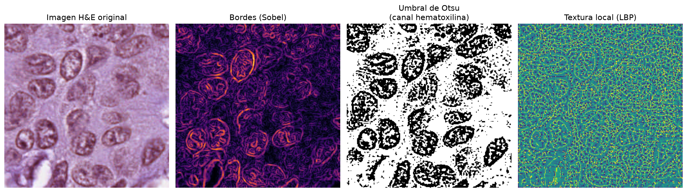
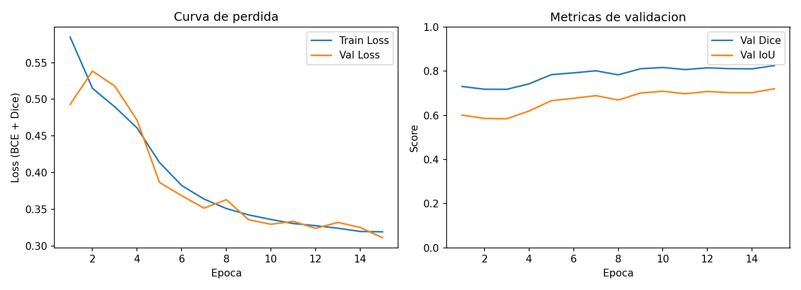
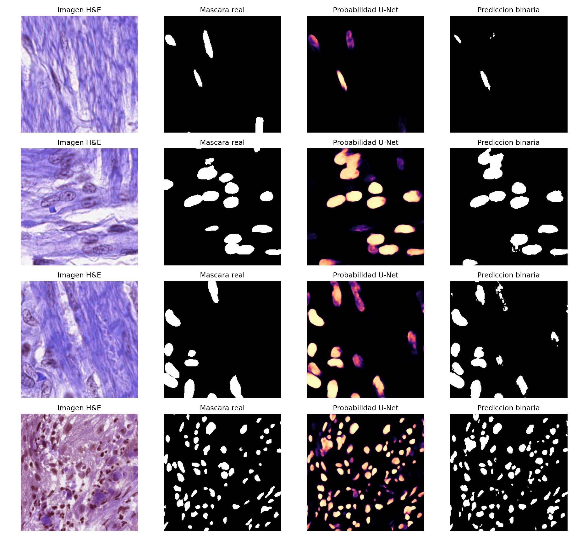

# Informe Módulo 2 — Segmentación Semántica de Núcleos con U-Net sobre PanNuke

Seminario de Deep Learning aplicado a Bioanálisis, PUCP. Módulo 2 del curso
(repositorio del profesor: [dlba-pucp](https://github.com/alexandrojim/dlba-pucp)),
evaluado según [RUBRICA.md](https://github.com/alexandrojim/dlba-pucp/blob/main/RUBRICA.md).
Este informe sigue explícitamente las 8 secciones de esa rúbrica.

Los números y figuras citados aquí provienen de artefactos versionados en este
repositorio (`metrics_summary.json`, `training_history.png`,
`qualitative_predictions.png`, `outputs_modulo2_pannuke_run.log`) o de
estadísticas recalculadas directamente sobre `data/raw_download/` para este
informe; ninguno es inventado.

---

## 1. Dataset y Estadísticas Generales

**Modalidad y origen.** [PanNuke](https://arxiv.org/abs/2003.10778) (Gamper et
al., 2019–2020) es un conjunto de parches de histopatología con tinción
**H&E** (hematoxilina-eosina), cubriendo **19 tipos de tejido**, con
anotaciones a nivel de núcleo en 5 categorías clínicas (Neoplásico,
Inflamatorio, Conectivo/Tejido blando, Muerto, Epitelial) más fondo. Este
proyecto usa el mirror [`llwlabs/pannuke`](https://www.kaggle.com/datasets)
de Kaggle, que redistribuye el dataset oficial ya recortado a parches PNG de
**256×256** con máscaras **binarias** (núcleo vs. fondo, sin distinción de
tipo), descargado vía [`descargar_pannuke.py`](../descargar_pannuke.py).

**Dimensiones y resolución.** Parches RGB de 256×256×3 (`uint8`), máscaras de
un canal (`L`, 0/255). Los parches se extrajeron al aumento **40×** del
dataset oficial; el mirror usado aquí no incluye metadatos de resolución
física (µm/px) por parche — limitación que se registra explícitamente en la
sección 8.

**Escala.** El pool total es de **7,901 pares imagen-máscara**
(`train/`: 6,716 + `validate/`: 1,185 = 7,901, el total oficial de PanNuke
según el comentario en
[`modulo2_pannuke_binary_segmentation.py`](../modulo2_pannuke_binary_segmentation.py#L73-L76)).

**Balance de clases (máscaras).** Recalculado sobre los 6,716 pares de
`train/` para este informe:

| Clase | % de píxeles |
|---|---|
| Fondo | 83.29% |
| Núcleo | 16.71% |

Este desbalance ~5:1 es el motivo directo de usar una pérdida compuesta
Dice + BCE en vez de solo entropía cruzada (ver sección 5).

**Partición train/val/test.** [`modulo2_pannuke_binary_segmentation.py`](../modulo2_pannuke_binary_segmentation.py#L341-L379)
separa 90/10 (train/val) dentro de `train/` y usa `validate/` completo como
test independiente, con semilla fija (`seed=42`, reproducible):

| Split | Pares | % del pool total |
|---|---|---|
| Train | 6,044 | 76.5% |
| Val | 672 | 8.5% |
| Test | 1,185 | 15.0% |

Nota crítica: esta partición **no** replica el 80/10/10 clásico que sugiere
la rúbrica ni el protocolo oficial de 3 folds de PanNuke — es la partición
train/validate que trae el mirror de Kaggle, con el 10% de validación
derivado internamente. Se documenta así, en vez de presentarla como 80/10/10,
por rigor.

---

## 2. Feature Engineering y Exploración Visual

Antes de fijar el preprocesamiento del modelo, se inspeccionó un parche real
de `train/` (`1-1138.png`, densidad nuclear alta: 44.6% de píxeles de
núcleo) con filtros clásicos de visión por computador:

- **Bordes (Sobel):** la magnitud del gradiente resalta las membranas
  nucleares y el contacto entre núcleos vecinos — confirma que el problema
  tiene bordes de baja curvatura pero alta densidad de contactos, el
  escenario donde las skip connections de U-Net (sección 4) importan más.
- **Umbral de Otsu** sobre el canal hematoxilina (`B − R`, el mismo proxy
  usado en [`04_unet_segmentation.py`](../04_unet_segmentation.py#L133-L136)
  para generar máscaras sintéticas): produce una segmentación **ruidosa**,
  con textura de sal y pimienta dentro y fuera de los núcleos. Esto motiva
  empíricamente por qué un umbral fijo global no basta y se justifica un
  modelo aprendido.
- **Textura local (LBP, `P=8, R=1`, uniforme):** expone la microtextura de
  la cromatina dentro de cada núcleo, relevante para distinguir atipia
  nuclear (irregularidades de textura asociadas a malignidad) — patrón que
  un clasificador de textura clásico podría explotar, pero que aquí se deja
  a las capas convolucionales de la U-Net para aprender implícitamente.

Conclusión de esta exploración: los núcleos son distinguibles por color
(hematoxilina) y textura, pero un umbral clásico es ruidoso a nivel de
píxel — justifica preferir una arquitectura que aprenda features locales y
de contexto (U-Net) sobre un pipeline puramente basado en umbral.

---

## 3. Definición de la Tarea

**Tarea:** segmentación semántica **binaria** a nivel de píxel — cada píxel
de un parche H&E de 256×256 se clasifica como **núcleo** (1) o **fondo**
(0). La salida del modelo es una máscara de la misma resolución espacial que
la entrada (256×256×1), no una detección de instancias ni una clasificación
a nivel de imagen completa.

**Relevancia biomédica:** en patología digital, la delimitación de núcleos
es el paso previo a estimar densidad celular, morfometría nuclear y — en
extensiones multiclase — tipo celular, todos insumos directos para
diagnóstico y graduación de tumores. Hacerlo manualmente es lento y sujeto a
variabilidad inter-observador; automatizarlo con un modelo entrenado sobre
miles de parches anotados apunta a reducir ambos problemas.

**Alcance explícito:** PanNuke ofrece máscaras con 5 tipos nucleares +
fondo; este proyecto usa la variante **binaria** (núcleo vs. fondo) del
mirror de Kaggle. Es una simplificación deliberada del problema completo de
6 clases, documentada como tal (no una confusión entre segmentación
semántica y detección de instancias) — la extensión a multiclase se deja
como trabajo futuro (sección 8).

---

## 4. Selección de Arquitectura

**U-Net desde cero en PyTorch** ([`modulo2_pannuke_binary_segmentation.py`](../modulo2_pannuke_binary_segmentation.py#L282-L308)),
siguiendo el diseño original de Ronneberger et al. (2015):

| Bloque | Detalle |
|---|---|
| `DoubleConv` | `[Conv3×3 → BatchNorm → ReLU] × 2`, `padding=1` (mantiene H×W) |
| Encoder (`DownBlock` ×4) | `MaxPool 2×2` + `DoubleConv`; canales `64→128→256→512→1024`, resolución espacial se reduce a la mitad en cada nivel |
| Bottleneck | Nivel más profundo (1024 canales, `H/16 × W/16`), máximo contexto semántico, mínima resolución espacial |
| Decoder (`UpBlock` ×4) | `ConvTranspose 2×2` + concatenación con el skip del encoder + `DoubleConv`; canales `1024→512→256→128→64` |
| Skip connections | Copian los mapas de features de alta resolución del encoder al decoder correspondiente, antes de perderlos en el max-pooling |
| Salida | `Conv 1×1` → 1 canal (logit binario por píxel) |

**Justificación a nivel de bloques:** el max-pooling del encoder gana
invariancia y contexto pero destruye la posición espacial fina — crítico
aquí porque los núcleos miden apenas ~10-30 px de diámetro en un parche de
256×256, y varios están en contacto directo (ver sección 2). Las skip
connections restauran esa resolución perdida directamente al decoder, en vez
de forzar al bottleneck a "recordar" bordes finos a través de 4 niveles de
downsampling — por eso se prefirió U-Net completo sobre, por ejemplo, un
backbone tipo ResNet sin decoder simétrico (adecuado para clasificación,
no para delimitar bordes de objetos pequeños y densos).

**Tamaño real del modelo:** `31,037,633` parámetros entrenables, confirmado
en tiempo de ejecución (`outputs_modulo2_pannuke_run.log`, línea
`[INFO] U-Net instanciada -- 31,037,633 parametros entrenables`) y verificado
analíticamente a partir de la definición de capas — cifra consistente con el
tamaño esperado de un U-Net de 5 niveles con el ancho de canales de
Ronneberger et al.

---

## 5. Justificación de Hiperparámetros

| Hiperparámetro | Valor | Justificación |
|---|---|---|
| Función de pérdida | `BCEWithLogitsLoss + DiceLoss` (peso 1:1) | El desbalance medido (83.29% fondo / 16.71% núcleo, sección 1) hace que BCE sola tienda a un óptimo trivial cercano a "todo fondo". El término Dice, al operar sobre la superposición relativa (`2·intersección / unión`), es insensible a esa proporción y empuja al modelo a cubrir la clase minoritaria. |
| Optimizador | Adam | Se prefirió sobre SGD por su tasa de aprendizaje adaptativa por parámetro, que converge más rápido con presupuestos de época reducidos (15 aquí) sin necesitar barrido manual de momentum/schedule, a costa de un poco más de memoria — aceptable para un modelo de 31M parámetros en una sola GPU. |
| Learning rate | `1e-3` | Valor por defecto estándar para Adam en CNNs entrenadas desde cero; la curva de pérdida (sección 6) confirma convergencia estable sin oscilaciones, por lo que no fue necesario reducirlo. |
| Batch size | 8 | Limitado por memoria de GPU dado el ancho de canales del bottleneck (1024) sobre parches de 256×256; no se exploró un batch mayor. |
| Épocas | 15 | Presupuesto fijo definido a priori (no hay early stopping, ver sección 6 y limitación en sección 8). |
| Semilla | 42 | Fija en la partición de datos y en el entrenamiento, para reproducibilidad. |
| Aumentación (train) | Flip horizontal, flip vertical, rotación 90/180/270°, aplicadas igual a imagen y máscara | Los núcleos no tienen una orientación canónica en el plano del portaobjetos, por lo que el grupo diedral (flips + rotaciones rectas) es una simetría válida. **Deliberadamente no se usa deformación elástica**: distorsiona la morfología nuclear, que es justamente el criterio que un patólogo usaría para evaluar atipia — aumentarla artificialmente introduciría una señal falsa. |

**Limitación reconocida:** el término BCE no usa `pos_weight` a pesar del
desbalance medido; toda la compensación de clase recae en el término Dice.
Ponderar también la BCE (o usar Focal Loss) es una mejora concreta pendiente
(sección 8).

---

## 6. Dinámica y Evaluación de Entrenamiento

Ambos paneles corresponden a la corrida de 15 épocas documentada en
[`Resultados-Modulo2/metrics_summary.json`](../Resultados-Modulo2/metrics_summary.json)
(GPU, 105.3 min totales). **Lectura de las curvas:** la pérdida de train y de
validación decrecen de forma prácticamente paralela durante las 15 épocas,
sin que la curva de validación se despegue hacia arriba — es decir, dentro
de este presupuesto de épocas no aparece una señal clara de sobreajuste.
Val Dice y Val IoU suben de forma monótona con ruido menor, sin meseta
pronunciada al final, lo que sugiere que el modelo probablemente seguiría
mejorando con más épocas.

**Control aplicado:** *checkpointing* — se guarda `best_model.pt` cada vez
que mejora el Dice de validación
([`modulo2_pannuke_binary_segmentation.py`](../modulo2_pannuke_binary_segmentation.py),
función `train_model`), así que el modelo evaluado en test (sección 7) es el
mejor punto de la corrida, no el de la última época.

**Limitación reconocida:** no se implementó *early stopping*; el límite de
15 épocas es fijo. Dado que la curva de validación no muestra sobreajuste
dentro de esa ventana, el impacto práctico en esta corrida es bajo, pero es
una omisión frente a lo que pide la rúbrica y una mejora concreta pendiente.

*(Nota de trazabilidad: `outputs_modulo2_pannuke_run.log` registra una
corrida distinta —6 épocas, CPU, submuestreo de 180/20/100 pares, usada como
verificación funcional (smoke test) del pipeline— cuyo Dice de test
(0.6965) es menor y no debe confundirse con el resultado reportado en la
sección 7, que proviene de la corrida completa en GPU.)*

---

## 7. Evaluación en Test y Métricas

**Métricas** (sobre el split de test independiente, `validate/` completo,
1,185 pares, nunca visto en entrenamiento ni en validación):

| Métrica | Valor |
|---|---|
| Dice (DSC) | **0.8283** |
| IoU (Jaccard) | **0.7228** |

Fuente: [`Resultados-Modulo2/metrics_summary.json`](../Resultados-Modulo2/metrics_summary.json).
La comparación cuantitativa contra el baseline provisto (`dataset/model.h5`,
Keras) se omitió en esta corrida por incompatibilidad de la capa
`Conv2DTranspose` del `.h5` original con Keras 3 — registrado en el mismo
JSON (`baseline_model_h5_metrics: null`).

**Ejemplos visuales (éxito y fallo):**

Cuatro parches de test, columnas: imagen H&E, máscara real, probabilidad
predicha, predicción binarizada (umbral 0.5). Inspección directa:

- **Éxito:** en las filas con clusters densos de núcleos (filas 2 y 4), la
  predicción cubre casi todos los núcleos visibles en la máscara real, con
  bordes limpios.
- **Fallo típico 1:** en la fila con núcleos alargados y de bajo contraste
  respecto al fondo (fila 1), el modelo tiende a omitirlos — el caso más
  difícil observado.
- **Fallo típico 2:** en clusters muy juntos (fila 3) aparece fragmentación
  menor en los bordes de contacto entre núcleos, en vez de una región
  sólida continua como en la máscara real.

---

## 8. Conclusiones y Sentido Crítico

**Síntesis.** Una U-Net de 31.0M de parámetros, entrenada desde cero con una
pérdida compuesta Dice + BCE sobre el desbalance medido de 83.29%/16.71%
(fondo/núcleo), alcanza Dice 0.828 / IoU 0.723 en segmentación binaria de
núcleos sobre el split de test independiente de PanNuke, en solo 15 épocas y
sin señal de sobreajuste dentro de esa ventana.

**Limitaciones:**

1. **Sesgo de dominio no evaluado:** PanNuke mezcla 19 tipos de tejido con
   variabilidad de tinción H&E entre laboratorios/escáneres; este proyecto
   no evaluó el desempeño desagregado por tejido ni la robustez del modelo
   ante esa variabilidad — un modelo con buen Dice global podría fallar en
   tejidos específicos sub-representados.
2. **Pérdida binaria parcialmente balanceada:** solo el término Dice
   compensa el desbalance de clases; la BCE no usa `pos_weight`.
3. **Sin early stopping ni validación cruzada de 3 folds:** se usó una
   única partición (no el protocolo oficial de PanNuke), con presupuesto de
   época fijo en vez de un criterio de parada basado en validación.
4. **Alcance binario:** se pierde la información clínicamente relevante de
   tipo nuclear (Neoplásico/Inflamatorio/Conectivo/Muerto/Epitelial)
   presente en las máscaras completas de PanNuke.
5. **Comparación contra baseline pendiente**, por incompatibilidad de
   entorno (Keras 3 vs. `.h5` original).
6. **Resolución física (µm/px) no documentada** en los metadatos del mirror
   usado, lo que limita interpretar el tamaño real de los núcleos en
   micrómetros.

**Mejoras concretas propuestas:**

- Extender a segmentación multiclase (5 tipos nucleares + fondo) usando las
  máscaras completas de PanNuke.
- Añadir `pos_weight` a la BCE o probar Focal Loss, y comparar contra la
  configuración actual.
- Implementar early stopping (paciencia sobre Val Dice) y correr validación
  cruzada de los 3 folds oficiales de PanNuke.
- Post-procesar con watershed marcado a partir de la máscara binaria para
  obtener instancias individuales y reportar PQ / AJI.
- Evaluar normalización de tinción (p. ej. Macenko o Reinhard) y desempeño
  desagregado por tejido, como paso previo a cualquier discusión de
  traducción clínica.

---

## Mapeo a la rúbrica

| Sección de la rúbrica | Evidencia en este repositorio |
|---|---|
| 1. Dataset y estadísticas | Sección 1 de este informe; [`descargar_pannuke.py`](../descargar_pannuke.py); [`modulo2_pannuke_binary_segmentation.py`](../modulo2_pannuke_binary_segmentation.py) |
| 2. Feature engineering | Sección 2; [`docs/feature_engineering.png`](feature_engineering.png) |
| 3. Definición de la tarea | Sección 3 |
| 4. Arquitectura | Sección 4; [`modulo2_pannuke_binary_segmentation.py`](../modulo2_pannuke_binary_segmentation.py) (clases `UNet`, `DoubleConv`, `DownBlock`, `UpBlock`) |
| 5. Hiperparámetros | Sección 5 |
| 6. Dinámica de entrenamiento | Sección 6; [`Resultados-Modulo2/training_history.png`](../Resultados-Modulo2/training_history.png) |
| 7. Evaluación en test | Sección 7; [`Resultados-Modulo2/metrics_summary.json`](../Resultados-Modulo2/metrics_summary.json), [`Resultados-Modulo2/qualitative_predictions.png`](../Resultados-Modulo2/qualitative_predictions.png) |
| 8. Conclusiones | Sección 8 |
| Entregable — muestras visuales | [`Resultados-Modulo2/`](../Resultados-Modulo2/) (PNG + notebook) |
| Entregable — presentación | [`Resultados-Modulo2/Modulo2_UNet_PanNuke_v2.pptx`](../Resultados-Modulo2/Modulo2_UNet_PanNuke_v2.pptx) |
